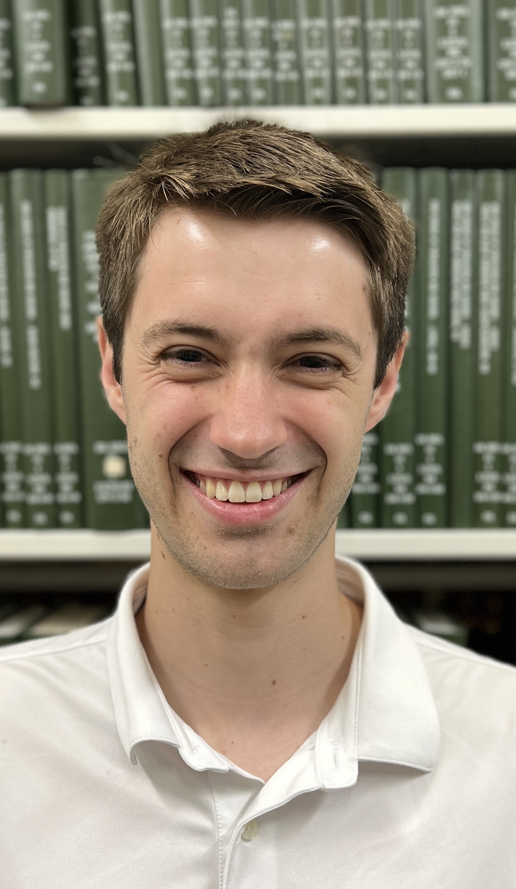

@def title = "Jack J. Garzella"

@@headshot 

@@

Hi! I'm Jack J Garzella, and I'm a Semester Research Fellow at [ICERM](https://icerm.brown.edu).

If we've met before, you probably know me by my nickname, JJ. 
[About my name](name/).

My research interests are in algebraic and analytic geometry
in positive and mixed characteristic, as well as computational number theory.

You can read a brief description of my research 
* for [non-mathematicians](research/non-mathematicians/), 
* for [mathematicians](research/mathematicians), or 
* for [potential employers or collaborators](research/employers-collabs/). 
You can also check out my [papers](research/).

Before being at ICERM, I was a graduate student at UCSD, where I was advised by [Kiran S. Kedlaya](https://kskedlaya.org/).

Email: jgarzellaucsd.edu but replace the "a" with an "@"
[What's going on?](email/)\\
Office: HSS 5044\\

<!-- Puedo responder a correo electr&#F3;nico en espa&#F1;ol -->

